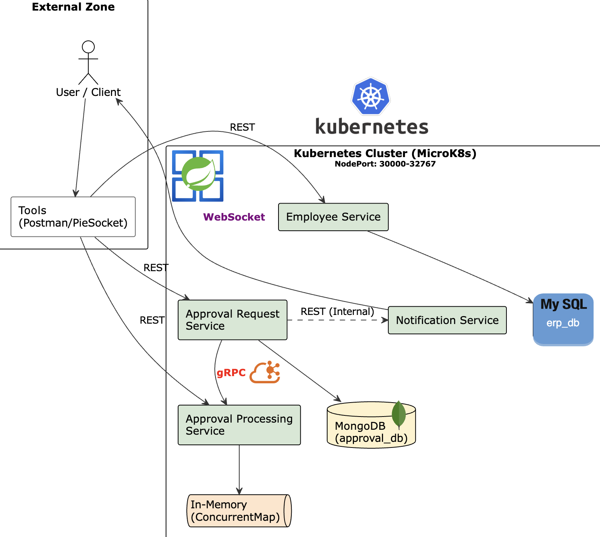

# 🏢 MSA 기반 사내 결재 시스템 (ERP System)

> **과목:** 고급프로그래밍실습  
> **소속:** 단국대학교 소프트웨어학과  
> **학번:** 32213336  
> **이름:** 이용찬

---

## 📖 프로젝트 개요
본 프로젝트는 마이크로서비스 아키텍처(MSA)를 기반으로 설계된 사내 결재 시스템입니다.  
기존 모놀리식 구조의 한계를 극복하고, 서비스 간 결합도를 낮추기 위해 **Docker**, **Kubernetes**, **Kafka**, **gRPC** 등 최신 클라우드 네이티브 기술을 적용하였습니다.

### 🎯 핵심 목표
* **MSA 구현:** 기능별로 독립된 4개의 마이크로서비스(Employee, Request, Processing, Notification) 구축.
* **Hybrid 통신:** 외부 통신(REST), 내부 고속 통신(gRPC), 비동기 이벤트 처리(Kafka), 실시간 알림(WebSocket) 혼용.
* **Polyglot Persistence:** 데이터 특성에 맞춰 MySQL(정형), MongoDB(비정형), In-Memory(고속 처리)를 적재적소에 활용.
* **DevOps:** Docker Multi-stage build 및 Kubernetes(MicroK8s) 오케스트레이션 적용.

---

## 🛠 Tech Stack

### Backend


### Database & Message Broker


### Communication


### Infrastructure


---

## 🏛 System Architecture



### 🔍 Architecture Overview
본 프로젝트는 **Kubernetes(MicroK8s)** 환경 위에서 동작하며, 서비스 간 결합도를 낮추기 위해 다양한 통신 프로토콜을 적재적소에 활용하였습니다.

* **External Zone:** 클라이언트(User) 및 테스트 도구(Postman, PieSocket)가 위치하며, NodePort를 통해 내부 클러스터에 접근합니다.
* **Kubernetes Cluster:**
    * **Microservices:** 기능별로 분리된 4개의 서비스(Employee, Request, Processing, Notification)가 독립적인 Pod로 실행됩니다.
    * **Polyglot Persistence:** 데이터 특성에 맞춰 MySQL(정형), MongoDB(비정형), In-Memory(고속 처리)를 혼용하였습니다.
    * **Event Broker:** **Kafka**를 도입하여 결재 요청과 처리 서비스 간의 완전한 비동기 처리를 구현했습니다.

---

### 🧩 Microservices
| 서비스명 | 역할 | Port | DB / Tech |
| :--- | :--- | :--- | :--- |
| **Employee Service** | 직원 정보 관리 및 조회 | `8081` | MySQL (JPA) |
| **Approval Request Service** | 결재 문서 기안 (Producer) | `8082` | MongoDB, **Kafka Producer** |
| **Approval Processing Service** | 결재 승인/반려 처리 (Consumer) | `8083` | In-Memory, **Kafka Consumer**, gRPC |
| **Notification Service** | 결재 완료 시 실시간 알림 | `8084` | **WebSocket** |

### 🔄 Data Flow
1. **Client**가 REST API를 통해 결재를 요청합니다.
2. **Request Service**는 문서를 MongoDB에 저장하고, **Kafka Topic(`approval-topic`)**으로 이벤트를 발행합니다. (비동기 처리)
3. **Processing Service**는 해당 토픽을 구독(Subscribe)하다가 메시지를 수신하여 메모리 큐에 적재합니다.
4. 결재자가 승인하면 **gRPC** 또는 내부 로직을 통해 상태를 업데이트합니다.
5. 최종 승인 시 **Notification Service**가 **WebSocket**을 통해 사용자에게 실시간 알림을 보냅니다.

---

## 🚀 Getting Started

### 1. Prerequisites
* Docker & Docker Compose
* Java 17+
* Kubernetes (MicroK8s, Minikube 등) - *선택 사항*

### 2. Run with Docker Compose (Local)
Kafka, Zookeeper, DB 및 모든 마이크로서비스를 한 번에 실행합니다.

```bash
# 레포지토리 클론
git clone [https://github.com/leeych1745/erp-system.git](https://github.com/leeych1745/erp-system.git)
cd erp-system

# Docker Compose 실행
docker compose up -d

# 상태 확인
docker ps
```

### 3. Run on Kubernetes
쿠버네티스 클러스터에 배포합니다.

```bash
# k8s 매니페스트 파일 적용
kubectl apply -f k8s/

# 파드 실행 상태 확인
kubectl get pods
```
---

## 📡 API Endpoints

| Service | Method | URI | Description |
| :--- | :--- | :--- | :--- |
| **Employee** | `POST` | `/employees` | 신규 직원 생성 |
| **Employee** | `GET` | `/employees/{id}` | 특정 직원 조회 |
| **Request** | `POST` | `/approvals` | 결재 문서 기안 (Kafka Publish) |
| **Request** | `GET` | `/approvals/{id}` | 결재 문서 상세 조회 |
| **Processing** | `POST` | `/process/{appId}/{reqId}` | 결재 승인/반려 처리 |
| **Notification** | `WS` | `/ws?id={userId}` | 실시간 웹소켓 연결 |

---

## 📂 Project Structure

```bash
erp-system/
├── employee-service/          # 직원 관리 (MySQL)
├── approval-request-service/  # 결재 요청 (MongoDB, Kafka Producer)
├── approval-processing-service/ # 결재 처리 (In-Memory, Kafka Consumer)
├── notification-service/      # 알림 (WebSocket)
├── k8s/                       # Kubernetes Manifest YAML files
├── scripts/                   # DB 초기화 스크립트
└── docker-compose.yml         # 로컬 실행용 인프라 설정
```

---

## ⚡ Key Features Implementation

### 1. Asynchronous Event-Driven (Kafka)
* **Decoupling:** `Request Service`와 `Processing Service` 간의 강한 결합을 제거하기 위해 Kafka를 도입했습니다.
* **Performance:** `KafkaTemplate`을 사용하여 이벤트를 발행하고, `@KafkaListener`로 수신하여 대량의 트래픽에도 안정적인 처리가 가능합니다. (로그 검증 결과: **50ms 내 처리**)

### 2. High Performance Communication (gRPC)
* 내부 서비스 간의 대량 데이터 동기화가 필요한 경우, Protocol Buffers 기반의 **gRPC**를 사용하여 JSON 대비 페이로드 크기를 줄이고 통신 속도를 최적화했습니다.

### 3. Container Orchestration (K8s)
* 각 서비스별로 `Deployment`와 `Service` (NodePort)를 분리하여 작성하였습니다.
* `Multi-stage build`를 적용한 Dockerfile을 통해 이미지 용량을 최소화하고 보안성을 높였습니다.
